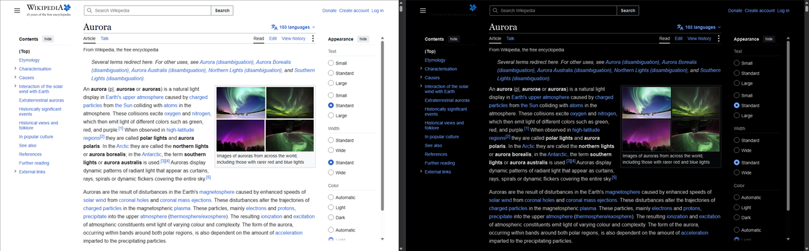

# Nightfall 🌙

Fast, simple dark mode for Chrome.



Nightfall is a Manifest V3 extension that turns any site dark with a single CSS
filter — no build step, no dependencies, no network requests, and no per-element
style rewriting to slow pages down or glitch out. It was built as a lighter-weight
alternative to Dark Reader: fewer knobs, fewer surprises.

## How it works

- The page is inverted with one `filter: invert(1) hue-rotate(180deg)` rule on
  `<html>`; images, video, canvas, and embeds are counter-inverted so photos
  still look natural.
- **Background photos** declared in stylesheets are found by a scanner that
  tags photo-sized boxes (≥96×72, non-tiling, real `url()`) so they get
  counter-inverted too. It reads in batches on idle time and re-checks only the
  parts of the page that change, so it doesn't slow scrolling down.
- **Every frame decides for itself.** Iframes are counter-inverted by the parent
  and darkened by their own copy of the script, so an embedded video that ships
  a dark player is left alone while a light comment widget is darkened to match.
- **Smart detection** measures the page's effective backdrop — what actually
  paints behind the content at five points across the viewport, so a theme
  painted on a full-page wrapper counts just like one on `<body>` — and leaves
  alone any site that needs no darkening: one that already ships a dark theme,
  or one built on
  a strongly colored background (a mid-tone brand color gains no darkness from
  inversion — it only gets its design scrambled). It re-checks after load and
  whenever the page flips a theme class, so sites with a runtime light/dark
  switch follow along in both directions. Verdicts are cached per site, so a
  skipped site never flashes inverted on a return visit.
- Your settings live in `chrome.storage.sync` and roam with your Chrome profile.
- Total footprint: ~460 lines of vanilla JS across a content script, a service
  worker, and the popup.

## Features

- 🌐 **Global switch** — dark mode everywhere, off with one click when you need it.
- 📌 **Per-site control** — Auto / On / Soft / Off for the current site, and
  overrides stick. **Soft** darkens without the full flip: dark grey instead of
  black, brand colors muted instead of inverted — made for colorful apps you
  stare at all day.
- 🌒 **Already-dark sites are skipped** automatically (toggleable).
- 🔆 **Brightness and contrast sliders** with live preview.
- 🖤 **Dark scrollbars** — the viewport scrollbar switches to Chrome's native
  dark style on darkened pages.
- ⌨️ **Alt+Shift+D** toggles the current site from the keyboard
  (rebindable at `chrome://extensions/shortcuts`).

## Installation

Nightfall isn't in the Chrome Web Store — load it unpacked:

1. **Get the code** — clone this repo, or *Code → Download ZIP* and extract it,
   to a folder on a local disk (cloud-drive mounts like Google Drive can break
   unpacked extensions):

   ```
   git clone https://github.com/cunninghambe/nightfall.git
   ```

2. Open `chrome://extensions` in Chrome.
3. Turn on **Developer mode** (toggle, top right).
4. Click **Load unpacked** and select the `nightfall` folder.
5. (Optional) Click the puzzle-piece icon in the toolbar and pin **Nightfall**
   so the popup is one click away.

To update later: `git pull`, then hit the reload arrow ↻ on the Nightfall card
at `chrome://extensions`.

## Usage

Click the toolbar icon to open the popup:

| Control | What it does |
|---|---|
| Header switch | Master on/off for the whole extension |
| **Auto / On / Soft / Off** | Per-site override for the current site; *Auto* follows the global setting plus smart detection; *Soft* is a gentler dark — grey canvas, muted colors — for saturated-brand sites |
| *Skip pages that are already dark or colorful* | Toggles smart detection |
| **Brightness** (60–110%) / **Contrast** (60–140%) | Applied live to every darkened page; **Reset** restores 100% |

**Alt+Shift+D** flips the current site between dark and light without opening
the popup.

## Regenerating the icons

The icons are generated, not hand-drawn:

```
powershell -ExecutionPolicy Bypass -File icons\make-icons.ps1
```

Writes `icon16.png`, `icon48.png`, and `icon128.png` next to the script
(Windows only — uses System.Drawing).

## Known limitations

- **Small or tiling background photos stay inverted.** The scanner treats a
  background image under 96×72, one that visibly tiles across its box, or one
  painted on a page-sized wrapper element as UI — an icon, a sprite sheet, a
  texture, a themed backdrop — and leaves it inverted with the rest of the
  page. A genuine photo used as a small thumbnail or a tiling backdrop gets
  caught by that.
- **A late dark theme can still flash on the first visit.** Nightfall inverts
  immediately at `document_start`; if the site paints its own dark theme a
  moment later, you'll see a brief inverted flash before detection catches up.
  Return visits use the cached verdict and don't flash.
- **Chrome's own pages** (`chrome://`, the Web Store) can't be scripted by any
  extension, so Nightfall does nothing there — the popup says so.

## License

[MIT](LICENSE)
